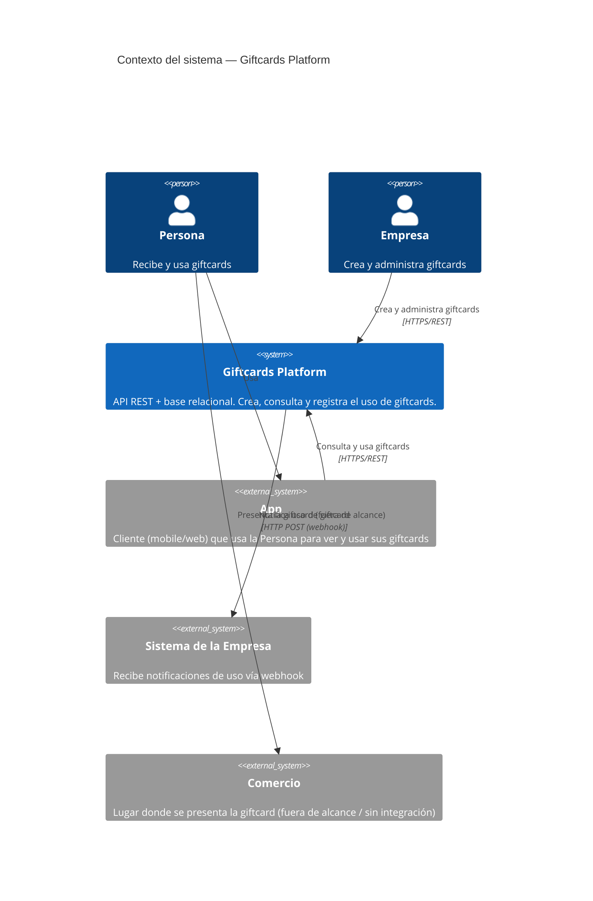
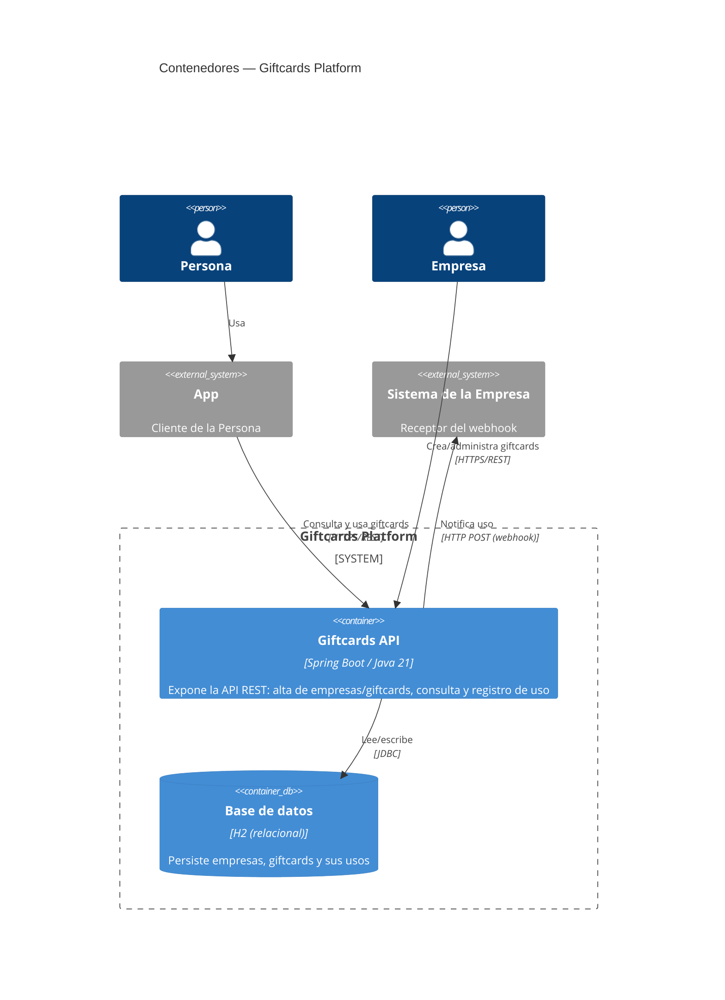
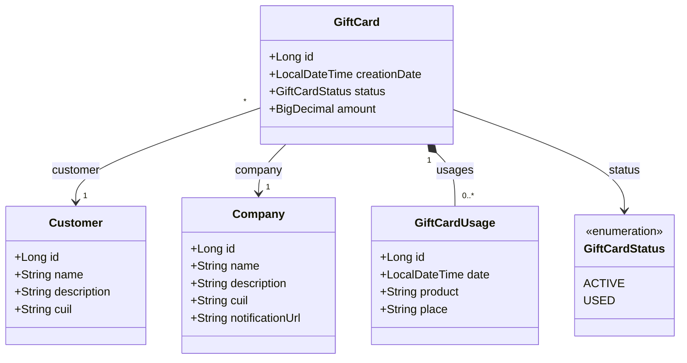

# ARCHITECTURE.md

Documento transversal (no cambia por feature/iteración). Complementa a `AGENTS.md`
(convenciones de código) con la descripción del dominio y la arquitectura general del sistema.
Cada `plan.md` de una feature puntual debería referenciar este documento en vez de repetir su
contenido.

## 1. Descripción general

Plataforma de **giftcards (tarjetas de regalo)**. Una empresa crea giftcards; una persona las
recibe y las usa a través de una app. Cada vez que se usa una giftcard, el sistema notifica ese
evento a la empresa mediante un webhook.

El sistema se implementa como una **API REST con persistencia en una base de datos relacional**
(ver `AGENTS.md` para el stack: Spring Boot + JPA + H2).

## 2. Actores y sistemas

- **Empresa** (persona/actor) — crea y administra sus giftcards. Configura la URL de webhook a
  la que quiere ser notificada cuando se usan.
- **Persona** (persona/actor) — recibe y usa una giftcard, a través de la App.
- **App** (sistema externo) — cliente (mobile/web) que usan las Personas para ver y usar sus
  giftcards. Este repo implementa la API que la App consume; la App en sí no forma parte de este
  repo.
- **Sistema de la Empresa** (sistema externo) — el receptor del webhook. Es responsabilidad de la
  Empresa tener un endpoint HTTP que reciba esas notificaciones.
- **Comercio** — el lugar (físico o digital) donde la Persona presenta la giftcard para recibir
  el descuento/regalo. **Fuera de alcance**: no es un actor integrado al sistema (ver más abajo).

## 3. Alcance y fuera de alcance

**Dentro de alcance (por ahora):**
- Alta de empresas y de giftcards.
- Consulta y uso de giftcards por parte de una Persona.
- Notificación por webhook a la Empresa cada vez que se usa una giftcard.

**Fuera de alcance (por ahora):**
- Manejo de dinero: el sistema no procesa pagos ni valores monetarios asociados al canje.
- El intercambio real entre el Comercio y la Persona (cómo se entrega el descuento/regalo al
  presentar la giftcard) no lo gestiona el sistema; se asume que ocurre "afuera" y que la App
  simplemente informa que la giftcard fue usada.
- Integración directa con sistemas de Comercios.
- Reintentos/garantías de entrega del webhook, autenticación del webhook, etc. — quedan como
  preguntas abiertas (sección 7) hasta que se necesiten.

## 4. Glosario de dominio

| Término | Significado |
|---|---|
| Empresa | Actor que crea y administra giftcards. Tiene un webhook configurado. |
| Giftcard | Tarjeta de regalo emitida por una Empresa. Tiene un estado (activa/usada, etc. — a definir en el spec de la feature correspondiente). |
| Persona | Actor final que recibe y usa una giftcard. |
| Uso / Canje | Evento que ocurre cuando una Persona usa una giftcard. Dispara la notificación webhook. |
| Webhook | Notificación HTTP saliente desde este sistema hacia el sistema de la Empresa, disparada por un uso/canje. |
| Comercio | Lugar donde se presenta la giftcard. Fuera de alcance como integración. |

## 5. Vista C4 — Contexto (Nivel 1)



## 6. Vista C4 — Contenedores (Nivel 2)



## 7. Diagrama de clases de dominio

Primera versión del modelo (clases planas en `model/`, todavía sin anotaciones JPA — ver
`AGENTS.md`).



Notas:
- `GiftCard` referencia a un `Customer` y una `Company` (muchas giftcards por cliente/empresa).
- La relación con `GiftCardUsage` es bidireccional: `GiftCard.usages` (lista) y
  `GiftCardUsage.giftCard` (referencia de vuelta). Se modeló como composición: un uso no tiene
  sentido sin su giftcard.
- `GiftCardStatus` por ahora solo tiene `ACTIVE`/`USED` — a revisar si hace falta algo como
  `EXPIRED` o `CANCELLED`.

## 8. Preguntas abiertas / próximos pasos

A resolver en los `spec.md`/`plan.md` de las features que correspondan, no acá:

- Cómo se identifica/autentica a una Empresa y a una Persona en la API (por ahora no hay
  autenticación definida).
- Formato del payload del webhook y política de reintentos ante fallas de entrega.
- Si `GiftCardStatus` necesita más estados (`EXPIRED`, `CANCELLED`, etc.) y qué reglas de
  negocio gobiernan las transiciones entre estados.

## 9. Referencias

- Convenciones de código: [`AGENTS.md`](AGENTS.md).


## 10. API REST

- La api es privada, pero vamos a suponer que la autenticación y autorización se manejan en otra
  app (gateway).
- Formato: JSON. Sin autenticación propia (delegada al gateway).
- Manejo de errores (`GlobalExceptionHandler`, ver `AGENTS.md`):
  - Recurso no encontrado → `404` con body `{"error": "<mensaje>"}`.
  - Violación de una regla de negocio (ej. `cuil` duplicado) → `409` con el mismo formato.
  - Datos inválidos en el request (bean validation) → `400` con el mismo formato.
- Recursos expuestos hasta ahora: `company`, `customer`. `giftcard` (alta + uso) queda pendiente,
  ver sección "Pendiente" más abajo y `Backlog.md`.

Los ejemplos asumen la app levantada en local (`./mvnw spring-boot:run`, perfil `local`, H2 en
memoria, sin datos precargados).

### Company

| Método | Path              | Descripción          |
| ------ | ----------------- | --------------------- |
| `POST` | `/companies`      | Alta de una company    |
| `GET`  | `/companies/{id}` | Consulta por id        |

Reglas de validación del alta:

- `name`: sin restricciones por ahora.
- `cuil`: obligatorio y único entre companies.
- `notificationUrl`: opcional; si viene, debe ser una URL `http(s)` válida.

**Alta**

```bash
curl -s -X POST http://localhost:8080/companies \
  -H "Content-Type: application/json" \
  -d '{"name":"Acme","description":"Retail de electrodomésticos","cuil":"30-11111111-1","notificationUrl":"https://acme.example.com/webhooks/giftcards"}'
```

Respuesta (`201 Created`):

```json
{
  "id": 1,
  "name": "Acme",
  "description": "Retail de electrodomésticos",
  "cuil": "30-11111111-1",
  "notificationUrl": "https://acme.example.com/webhooks/giftcards"
}
```

Si el `cuil` ya existe (`409 Conflict`):

```json
{ "error": "A company with cuil 30-11111111-1 already exists" }
```

Si falta el `cuil` o `notificationUrl` no es una URL válida (`400 Bad Request`):

```json
{ "error": "cuil is required" }
```

```json
{ "error": "notificationUrl must be a valid http(s) URL" }
```

**Consulta**

```bash
curl -i http://localhost:8080/companies/1
```

`200 OK` con el mismo body que el alta. Si no existe, `404 Not Found`:

```json
{ "error": "Company not found with id 999" }
```

### Customer

| Método | Path              | Descripción         |
| ------ | ----------------- | -------------------- |
| `POST` | `/customers`      | Alta de un customer   |
| `GET`  | `/customers/{id}` | Consulta por id       |

**Alta**

```bash
curl -s -X POST http://localhost:8080/customers \
  -H "Content-Type: application/json" \
  -d '{"name":"Juana Pérez","description":"Clienta frecuente","cuil":"27-33333333-3"}'
```

Respuesta (`201 Created`):

```json
{
  "id": 1,
  "name": "Juana Pérez",
  "description": "Clienta frecuente",
  "cuil": "27-33333333-3"
}
```

**Consulta**

```bash
curl -i http://localhost:8080/customers/1
```

`200 OK` con el mismo body que el alta. Si no existe, `404 Not Found`:

```json
{ "error": "Customer not found with id 999" }
```

### Pendiente

- Alta y uso de `giftcard`: asociar a `Company` + `Customer`, registrar `GiftCardUsage` y
  disparar el webhook al `notificationUrl` de la company.
- Listados/paginación: por ahora cada recurso solo tiene consulta por id.
- Validaciones de `Customer` (hoy solo `Company` valida unicidad/formato — a extender si hace
  falta).
